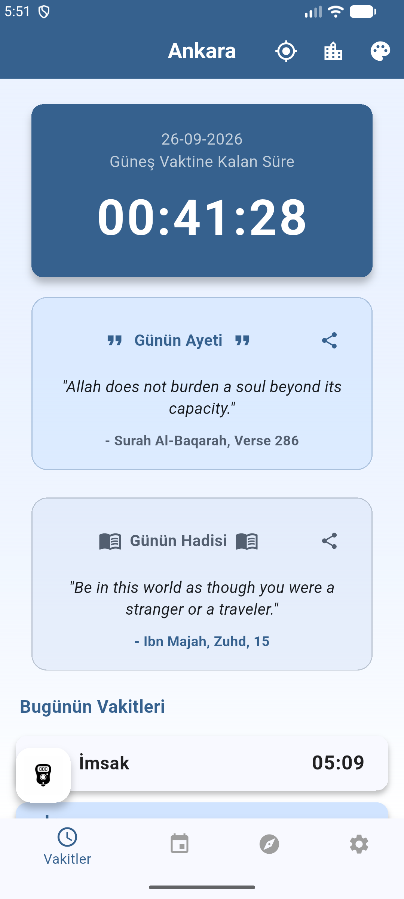
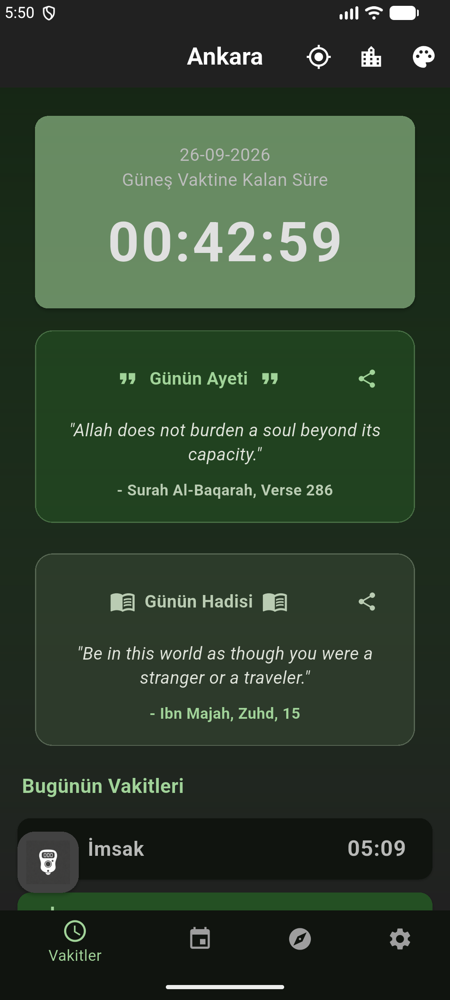
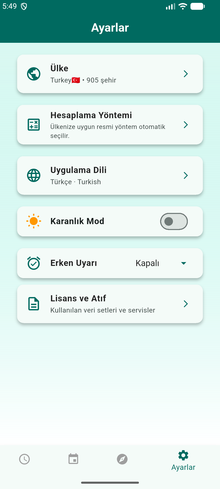
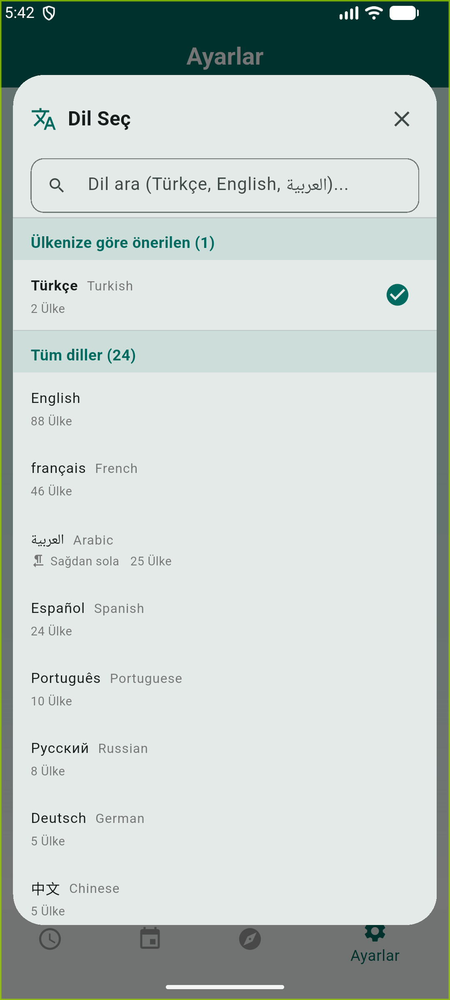
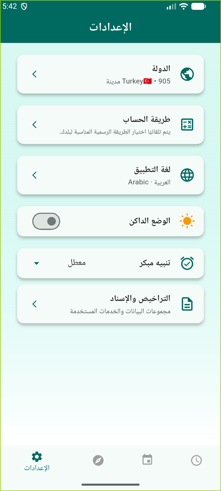
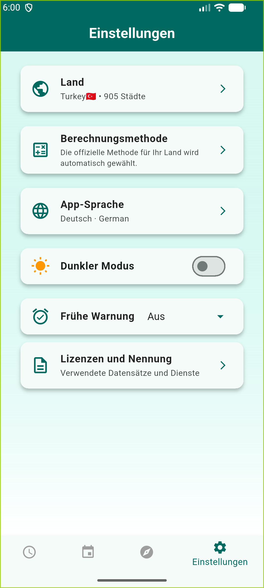
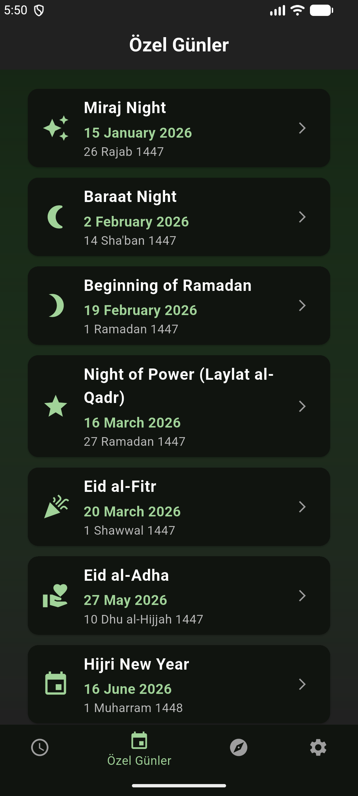
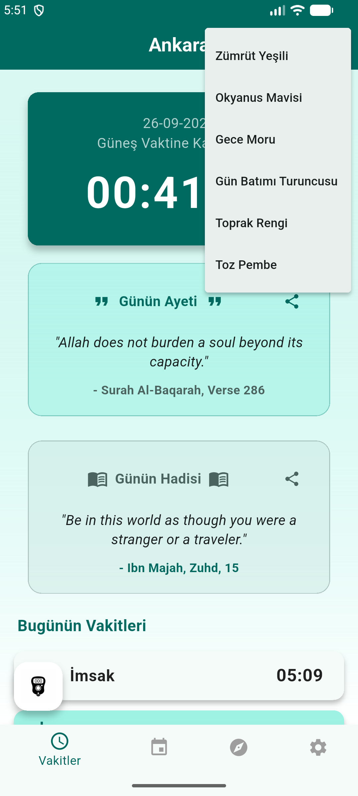

# 🕌 Namaz Vakitleri & Kıble Pusulası (Prayer Times App)

Modern arayüzü, temiz kod mimarisi ve kapsamlı özellikleriyle Flutter kullanılarak geliştirilmiş çok dilli bir İslami yaşam uygulaması. Uygulama, kullanıcılara namaz vakitlerini takip etme, kıble yönünü bulma, günlük ayet/hadis okuma ve dini günleri takip etme imkanı sunar.


## ✨ Öne Çıkan Özellikler

* 🌍 **245 Ülke, 141.135 Şehir:** Avrupa, Amerika, Asya, Afrika ve Okyanusya kıtalarındaki 245 ülkenin **tüm şehirleri** uygulamada dahildir. Ülke seçimi **Ayarlar** menüsünden yapılır (kıta gruplarına ayrılmış, aramalı liste); şehir seçimi ana ekrandaki şehir düğmesiyle yapılır. Şehirler Türkçe karakterden bağımsız aranır ("suleyman" yazan kullanıcı "Süleyman" bulur).
* 🗺️ **GPS ile Konum Bulma:** `geolocator` ve `geocoding` ile kullanıcının bulunduğu ülkeyi ve şehri otomatik tespit etme. Vakitler tam GPS koordinatı üzerinden hesaplanır.
* 🕋 **Kıble Pusulası:** Cihazın donanımsal pusula sensörü (`flutter_compass`) ve özel trigonometrik hesaplamalar ile tam isabetli yön bulma. Hedefe ulaşıldığında titreşimli (`HapticFeedback`) geri bildirim.
* ⏱️ **Canlı Geri Sayım ve Vakitler:** Aladhan API entegrasyonu ile günlük namaz vakitlerinin çekilmesi ve sıradaki vakte kalan sürenin dinamik hesaplanması.
* 🧮 **Ülkeye Göre Hesaplama Yöntemi:** Hesaplama yöntemi vakitleri kaydırdığı için uygulama `method` parametresini göndermez; Aladhan ülkeye göre resmi yöntemi kendisi seçer (TR→Diyanet, US→ISNA, EG→Mısır, SA→Umm al-Qura, ID→KEMENAG, FR→UOIF, TN→Tunus, MY→JAKIM). Kullanıcı Ayarlar'dan 24 resmi yöntem arasından kendi camiyinin yöntemini seçebilir.
* 🔔 **Arka Plan Bildirimleri:** Uygulama kapalı olsa dahi ezan vakti girdiğinde `flutter_local_notifications` ile yerel bildirim (alarm) gönderme.
* 📱 **Ana Ekran Widget'ları (Home Widgets):** Android cihazlar için uygulamanın içine girmeden sıradaki vakti, "Günün Ayeti"ni ve "Günün Hadisi"ni gösteren ana ekran araçları.
* 🌐 **Çoklu Dil Desteği (i18n) — 25 dil:** `easy_localization` ile **Türkçe, İngilizce, Arapça, Farsça, Almanca, Fransızca, İspanyolca, Portekizce, Rusça, İtalyanca, Hollandaca, Japonca, Korece, Lehçe, Rumence, Amharca, Bengalce, Moğolca, Nepalce, Tamilce, Tayca, Türkmençe, Ukraynaca, Vietnamca, Endonezce ve Çince** arayüz. Arama ile dil seçimi, ülkeye göre öneri, otokton ad (kendi dilinde ad) ve **RTL (sağdan sola) tam yansıma** Arapça ve Farsçada çalışır.
* 🎨 **Dinamik Tema Motoru:** Kullanıcının seçtiği temanın (Zümrüt Yeşili, Okyanus Mavisi, Gece Moru vb.) `ValueNotifier` ile tüm uygulamaya anında yansıması ve `shared_preferences` ile hafızaya kaydedilmesi.
* 📅 **Dini Günler Ajandası:** 2026 (1447-1448 Hicri) yılına ait özel dini günlerin listelenmesi ve detaylı açıklamaları.
* 📤 **Paylaşım Özelliği:** Günün ayet ve hadislerini diğer uygulamalarda (`share_plus`) paylaşabilme.

## 🏗️ Mimari ve Klasör Yapısı (Layered Architecture)

Proje, Sorumlulukların Ayrılması (Separation of Concerns) prensibine uygun olarak katmanlı bir yapıda geliştirilmiştir. Bu sayede spagetti kod engellenmiş ve sürdürülebilirlik maksimize edilmiştir:

* 📂 **`lib/pages/` (View Katmanı):** Sadece arayüz (UI) çizimlerini barındıran modüler sayfalar (`anasayfa.dart`, `kible_sayfasi.dart`, `ozelGunler_sayfasi.dart`, `ayarlar_sayfasi.dart`).
* 📂 **`lib/widgets/` (UI Bileşenleri):** Yeniden kullanılabilir seçici diyalogları (`ulke_secici.dart`, `sehir_secici.dart`, `dil_secici.dart`).
* 📂 **`lib/data/` (Repository Katmanı):** Ayetler, Hadisler, Özel Günler veri havuzu (`veri_havuzu.dart`) ve ülke/şehir verisinin yüklenmesi (`ulke_verisi.dart`).
* 📂 **`lib/utils/` (Business Logic):** Matematiksel kıble hesaplamaları gibi arayüzden bağımsız çalışan yardımcı algoritmalar.
* 📄 **`lib/main.dart` (Entry Point):** Bağımlılıkları başlatan, temayı ayarlayan, seçili ülke/şehir durumunu yöneten ana iskelet.
* 🔧 **`tool/` (Veri Üretimi):** Ülke/şehir veri dosyalarını üreten `sehir_verisi_uret.dart`, veri bütünlüğünü denetleyen `sehir_butunluk_denetim.dart` ve çeviri anahtarı güncelleyici `cevirileri_guncelle.dart`.

## 🗺️ Ülke ve Şehir Verisi

Uygulama, Aladhan API'nin şartlarından dolayı **koordinat tabanlı** çalışır:

Aladhan'in `calendarByCity` uç noktası dahili bir geocoder kullanır ve büyük veri setindeki küçük şehirlerin çoğunu çözemez; bu istekler `503 Geocoding is temporarily unavailable` ile başarısız olur. Bu nedenle uygulama, aynı aylık veriyi (30 gün) koordinatla döndüren `/v1/calendar` uç noktasını kullanır. **141.135 şehir** bu sayede sorunsuz çalışır.

Koordinat yaklaşımının ikinci bir faydası daha var: `meta.timezone` her zaman doğru geldiği için ezan alarmları seçilen şehrin saat diliminde doğru zamanlanır.

## 🧮 Hesaplama Yöntemi

Aladhan'ın `method` parametresi namaz vakitlerini doğrudan etkiler. Uygulama bu parametreyi **göndermez**; böylece Aladhan ülkeye göre resmi yöntemi kendisi seçer.

Neden otomatik? Aynı şehirde yöntem değişince vakitler kayıyor. `method=13` (Türkiye) her ülkede sabit kullanıldığında ölçülen sapmalar (Eylül 2026):

| Şehir | Doğru yöntem | `method=13` sapması |
| :--- | :--- | ---: |
| Paris | UOIF (12) | **Fajr 38 dk, İşâ 31 dk** |
| New York | ISNA (2) | **Fajr 16 dk, İşâ 11 dk** |
| Kahire | Mısır (5) | Fajr 7 dk |
| Suudi Arabistan | Umm al-Qura (4) | **İşâ 19 dk** |
| Endonezya | KEMENAG (20) | Fajr 8 dk |
| İstanbul | Diyanet (13) | — (zaten doğru) |

Otomatik moda geçildikten sonra Paris'te sapma **38 dakikadan 0'a** indi ve 12 ülke örneğinin tamamı doğru yöntemi aldı.

Kullanıcı **Ayarlar → Hesaplama Yöntemi** ekranından 24 resmi yöntem arasından seçebilir. Bu gereklidir çünkü "doğru" yöntem ülkeye göre değil, kullanıcının takip ettiği camiye ve mezhebe göre değişir. Yöntem listesi `https://api.aladhan.com/v1/methods` uç noktasından alınmıştır; açı değerleriyle birlikte gösterilir.

| | |
| :--- | :--- |
| **Kapsam** | Avrupa (53), Amerika (56), Asya (50), Afrika (60), Okyanusya (26) → **245 ülke** |
| **Kayıt sayısı** | **160.869** = 34.229 şehir + 126.640 köy |
| **Kaynak** | [dr5hn/countries-states-cities-database](https://github.com/dr5hn/countries-states-cities-database) (ODbL-1.0) + [GeoNames](https://www.geonames.org/webservices/) cities500/1000/5000/15000 ve admin1CodesASCII (CC BY 4.0) |
| **Üretim** | `dart run tool/sehir_verisi_uret.dart` |

**Dosya düzeni:** `assets/veri/ulkeler.json` (ülke listesi, 65 KB) uygulama açılışında yüklenir. Şehirler ülke başına ayrı dosyalarda tutulur (`assets/veri/sehirler/TR.txt`) ve **yalnızca seçilen ülke açıldığında** okunup önbelleğe alınır. En kalabalık ülke dosyası (ABD, 16.867 kayıt) 717 KB'dır; uygulama açılışında 4.5 MB'lık şehir verisinin tamamı yüklenmez.

**Kapsam dışı bırakılanlar:** Kutup bölgeleri (Polar) ve şehir/koordinat verisi bulunmayan iki yerleşim — `United States Minor Outlying Islands` (kalıcı nüfusu yok) ve `Tokelau`.

### 🗃️ Şehir verisi nasıl üretiliyor

**160.869 kayıt**, 245 ülke, 34.229 şehir + 126.640 köy.

#### Neden iki sekme?

Veri tabanı ilçe ve köy düzeyini de içerir. Türkiye için 1.049 kayıt var ama
bunların 615'i nüfusu 15.000'in altında küçük yerleşimler. Bunlar alfabetik
sırayla listelenirse kullanıcı ilk ekranda **"Abana, Acıgül, Adaklı"** görür,
Adana ancak 6. sırada olur. Bu yüzden seçici iki sekmelidir:

| Sekme | İçerik | Sıralama |
| :--- | :--- | :--- |
| **Şehirler** | nüfusu ≥ 15.000 | büyükten küçüğe |
| **Köyler** | nüfusu < 15.000 (veya bilinmeyen) | alfabetik |

Arama yazıldığında sekmeler gizlenir ve tüm kayıtlar taranır — kullanıcı ne
aradığını bilmiyor olabilir.

#### Aynı adlı yerler nasıl ayırt ediliyor?

Türkiye'de iki "Gölbaşı" vardır ve bu bir belirsizlik yaratır:

```
39.7904|32.8090|Gölbaşı|Ankara|165201|          →  Ankara / Gölbaşı
37.7836|37.6367|Gölbaşı|Adıyaman|28078|         →  Adıyaman / Gölbaşı
```

Her kayıt **il bilgisini** taşıdığı için liste "Kahramanmaraş / Dulkadiroğlu"
gibi etiketlenir ve kullanıcı hangisini seçtiğini anlar. Aynı mekanizma
ABD'de "Texas / Dallas" ile "Oregon / Dallas"ı ayırır.

Bu ayrım veri katmanında şart: ayırt edici anahtar **(ad, il)** çiftidir.
Daha önce anahtar yalnızca **ad** idi ve aynı adlı ikinci yer sessizce
atlanıyordu — ölçülen kayıp **1.271 yer** (nüfus ≥ 15.000), bunların
1.105'i için listedeki aynı adlı kayıt **300 km'den uzaktaydı**. Yani
kullanıcı "Dallas" yazınca vakitleri 1.118 km öteden alıyordu.

#### Kayıt biçimi

```
enlem|boylam|ad|il|nüfus|takma1,takma2
```

Altıncı alan, aramada da eşleşmesi istenen alternatif adlardır. İki veri
kaynağı aynı şehri farklı yazımlarla saklar; tek satırda birleştirilir:

```
48.1374|11.5755|München|München|1488000|Munich
45.0705|7.6868|Torino|Turin|847287|Turin
38.6120|27.4265|Manisa|Manisa|440336|
```

Alman kullanıcı "München", İngiliz kullanıcı "Munich" yazar; ikisi de aynı
kaydı bulur, listede mükerrer görünmez.

#### Üretim

Tek araç: `dart run tool/sehir_verisi_uret.dart`

| Kaynak | Katkısı | Lisans |
| :--- | :--- | :--- |
| dr5hn/countries-states-cities-database | her yerleşimin **ili** (`states[].cities[]`) | ODbL-1.0 |
| GeoNames `cities500` + `1000` + `5000` + `15000` | **nüfus** (merdiven; 500'den küçük olmayan her yerleşim) | CC BY 4.0 |
| GeoNames `admin1CodesASCII.txt` | GeoNames il kodunun **yerel dilde il adına** çevrilmesi | CC BY 4.0 |

Adım adım:

1. **dr5hn tabanı** — 152.970 yerleşim, il bilgisiyle.
2. **Nüfus zenginleştirme** — *yalnızca isim eşleşmesiyle*. Nüfus bir yere
   aittir; yakınlıkla eşleştirmek yanlıştır (önceki sürümde Kahramanmaraş'ın
   nüfusu 700 m ötedeki Dulkadiroğlu'na yazılıyordu).
3. **Önemli GeoNames şehirlerini ekle** — aynı ad varsa **yakınlık belirleyici**:
   25 km içindeyse aynı şehir (nüfus tamamlanır, diğer ad takma ad olur),
   dışındaysa **farklı bir yerdir** ve eklenir.
4. **Türkiye** — resmî 81 il kanonik yazımla, ASCII formlar (`Diyarbakir`,
   `Agri`, `Sanliurfa`) resmî yazıma çevrilir.
5. **Yerel ad** — büyük şehirlerde yerel ad ana ad, uluslararası ad takma ad
   (`Wien|Vienna`, `Makkah|Mecca`).
6. **Çakışma temizliği** — takma ad, başka bir kaydın ana adıyla çakışmaz.

#### Arama sıralaması

Sonuçlar ham dosya sırasında değil **alakalılığa göre** sıralanır:

| Puan | Eşleşme | Örnek |
| ---: | :--- | :--- |
| 0 | ad tam eşleşme | "Kahramanmaraş" → Kahramanmaraş |
| 1 | takma ad tam eşleşme | "Munich" → München |
| 2 | ad ile başlıyor | "Kahr" → Kahramanmaraş |
| 3 | il tam eşleşme | "Kocaeli" → İzmit |
| 4 | il ile başlıyor | |
| 5 | herhangi bir yerde geçiyor | |

Aynı puan içinde **büyük şehir önce** gelir. Bu şart: "New York" yazan
kullanıcı, New York eyaletinin yüzlerce köyüyle sonuç sınırına takılıp
New York City'yi hiç görmüyordu.

#### Koruma

`test/sehir_kapsam_test.dart` (143 test) şunları doğrular: 81 ilin tamamı,
öndeki büyük şehirler, **aynı (ad, il) ve aynı koordinat mükerreri yok**,
takma ad çakışmaları yok, Gölbaşı/Dallas/Ereğli ayrımı çalışıyor, arama
sıralaması gerçek şehri kesmiyor, 25 dilde sekme başlıkları çevrili.
`tool/sehir_butunluk_denetim.dart` ise 245 dosyanın tamamını bağımsız
denetler.

#### Bilinen sınır

16 mikro-bölge (Anguilla, Vatikan, Cocos, Pitcairn…) listede **0 şehir**
gösterir: kaynak veride yerleşim kaydı yoktur ve nüfusları 15.000 eşiğinin
altındadır (Anguilla'nın nüfusu 13.254'tür, tüm ada). Bu durumda seçici
"şehir verisi yok" der.

## 📦 Kullanılan Temel Paketler

| Paket Adı | Kullanım Amacı |
| :--- | :--- |
| `http` | Aladhan API istekleri (koordinat tabanlı `/v1/calendar`) |
| `easy_localization` | Çoklu dil desteği (25 dil, `assets/i18n/ceviri/<3-harfli-kod>.json`) |
| `flutter_local_notifications` | Arka plan alarmları ve yerel bildirimler |
| `geolocator` & `geocoding` | GPS ile ülke/şehir tespiti |
| `timezone` | Alarmların seçilen şehrin saat diliminde zamanlanması |
| `flutter_compass` | Donanımsal yön (heading) verisi |
| `home_widget` | İşletim sistemine entegre ana ekran araçları |
| `shared_preferences` | Kullanıcı tercihleri (Şehir, Tema vb.) önbellekleme |

## 🚀 Kurulum ve Çalıştırma

Projeyi kendi bilgisayarınızda çalıştırmak için aşağıdaki adımları izleyebilirsiniz:

1. Repoyu klonlayın:
   ```bash
   git clone [https://github.com/KULLANICI_ADIN/namaz_vakitleri.git](https://github.com/KULLANICI_ADIN/namaz_vakitleri.git)
2. Proje dizinine gidin ve bağımlılıkları indirin:
   ```bash
   cd namaz_vakitleri
   flutter pub get
3. Uygulamayı derleyin ve çalıştırın:
   ```bash
   flutter run
(Not: Widget ve arka plan bildirim özelliklerinin tam çalışması için gerçek bir Android/iOS cihazda test edilmesi önerilir.)

4. Ülke/şehir verisini yeniden üretmek isterseniz (isteğe bağlı — veriler depoda gelir):
   ```bash
   # Kaynak dosyalar (üçü de geçici klasöre indirilir):
   #   dr5hn/countries-states-cities-database -> json/countries+states+cities.json
   #   GeoNames -> cities500.zip, cities1000.zip, cities5000.zip,
   #               cities15000.zip, admin1CodesASCII.txt
   dart run tool/sehir_verisi_uret.dart

   # Üretilen verinin bütünlüğünü denetlemek için:
   dart run tool/sehir_butunluk_denetim.dart

   # Yeni arayüz metinlerini çeviri dosyalarına eklemek için:
   dart run tool/cevirileri_guncelle.dart
   ```

## 🌐 Diller

Uygulama 245 ülkenin **152 resmî dilini** tanır. Dil listesi elle yazılmamıştır; `mledoze/countries` (ulke→dil) ve `haliaeetus/iso-639` (otokton adlar) veri setlerinden üretilir:

```bash
dart run tool/dil_katalogu_uret.dart <countries-json> <iso639-json>
```

| Özellik | Durum |
| :--- | :--- |
| Katalogdaki resmî dil | 152 |
| Otokton adı bulunan | 111 |
| Sağdan sola (RTL) yazan | 7 (Arapça, Farsça, Urduca, İbranice, Aramice, Dhivehi, Peştuca) |
| **Çevirisi hazir olan** | **25** |

**Çeviri dosyası adı = dil kodu = `Locale` kodu.** `tur.json` ↔ `tur` ↔ `Locale('tur')`. Bu eşleme bozulursa easy_localization dosyayı bulamaz ve arayüzde anahtar adları (`today_times`, `settings`) görünür. Yeni bir çeviri dosyası eklemek için `assets/i18n/ceviri/<kod>.json` yazmak **ve** `assets/i18n/diller.json` içindeki `hazirDiller` listesine kodu eklemek yeterlidir; `supportedLocales` katalogdan geldiği için kodda güncelleme gerekmez.

> ⚠️ **3 harfli kod tuzağı.** Ceviri dosyaları ISO 639-2/3 (3 harfli) kodla adlandırılır (`tur.json`, `eng.json`, `ara.json`) çünkü bu, 152 dilli katalogdaki `kod` alanıyla birebir aynıdır. Ancak Flutter'ın `GlobalMaterialLocalizations` / `GlobalWidgetsLocalizations` / `GlobalCupertinoLocalizations` delegeleri **yalnızca 2 harfli ISO 639-1** kodlarını tanır (`tr` var, `tur` yok). Bu ikisi çatışır:
>
> - Locale 3 harfli verilirse → `"No MaterialLocalizations found"` hatası, arayüz kırmızı hata ekranıyla çöker.
> - Locale 2 harfli verilirse → easy_localization `tr.json` diye **var olmayan** dosyayı arar, tüm anahtarlar `"not found"` olur ve arayüz ham anahtar adlarını gösterir.
>
> Çözüm `lib/utils/iso1_yerellestirme.dart` içindedir: Locale 3 harfli kalır (dosya adı doğru çözülsün), sarmalayıcı delegeler 3 harfli kodu alıp Material/Widgets/Cupertino tarafına **ISO-1** ile gider. Flutter'ın 116 Material yerellestirmesi vardır; desteklenmeyen bir kod gelirse (ör. Türkmen `tk`) arayüzün çökmesi yerine İngilizce'ye düşülür.

**Hangi 25 dil?** Ülke sayısı ölçütüyle seçim pratikte yanlıştı (Türkçe'yi 1 ülkeye indirip "Austro-Bavarian German" seçiyordu). Müslüman nüfusuyla ağırlıklandırıldığında **207/245 ülke ve Müslüman nüfusunun %98,8'i** kapsanıyor:

`amh ara ben deu eng fas fra ind ita jpn kor mya nep pol por ron rus spa tam tha tuk tur ukr vie zho`

| | |
| :--- | :--- |
| **Çeviri dosyası sayısı** | **25** (`assets/i18n/ceviri/*.json`) |
| **Anahtar sayısı (dosya başına)** | **83** |
| RTL çevirisi olan | 2 (Arapça, Farsça) |

**Arayüzde üç ayrıntı:**
- Kullanıcının seçili ülkesinin resmî dilleri en üstte önerilir.
- Arama hem otokton adı hem İngilizce adı hem ISO kodunu kapsar ve Türkçe karakterden bağımsızdır.
- RTL dillerde `MaterialApp.builder` ile `Directionality` uygulanır; aksi hâlde menüler ve listeler okunmaz hâle gelir.

**İçerik çevrileri:** Ayet metinleri şu an uygulama içine gömülü olarak gelir ve yalnızca TR/EN/ZH dillerinde gösterilir. Ayetler için [AlQuran Cloud](https://alquran.cloud) üzerinden çok dilli çeviriye geçilmesi planlanmaktadır (25 dilin 21'inde kaynaklı çeviri mevcut; kalan 4 dilde İngilizceye düşülür). Hadis metinlerinin güvenilir bir çok dilli kaynağı bulunmadığı için yalnızca TR/EN/ZH dillerinde gösterilecektir.

> ⚠️ **İçerik verisi 2 harfli kodla anahtarlıdır.** Arayüz 3 harfli (`tur`) çalışırken gömülü içerik ISO 639-1 (`tr`) anahtarlarıyla yazılmıştır — bkz. `lib/data/veri_havuzu.dart` ve `lib/data/ozel_gunler.dart`. Bu iki kod dünyası arasındaki köprü `lib/utils/icerik_dili.dart` içindeki `icerikDilKodu()`'dur ve **katalogdan** beslenir (152 dilin `kod`/`iso1` alanları). Köprü atlanırsa `ayetler['tur']` null döner, `?? ayetler['en']!` devreye girer ve Türkçe seçili kullanıcı Türkçe yerine İngilizce ayet, hadis ve özel gün metinleri görür. Yeni içerik dili eklerken veri anahtarını değiştirmek yerine bu fonksiyonu kullanın; regresyon testi `test/icerik_dili_test.dart` dosyasındadır.

## 📸 Ekran Görüntüleri

`ekran_goruntuleri/` klasöründe Android emülatörde (API 37, 1080×2400) alınmış ekran görüntüleri bulunur.

**Ana ekran — Okyanus Mavisi (açık tema)**


**Ana ekran — Zümrüt Ormanı (karanlık tema)**


**Ayarlar (25 dil seçimi, hesaplama yöntemi, erken uyarı)**


**Dil seçici — 25 dil, ülkeye göre öneri, arama**


**Arapça — RTL (sağdan sola) tam yansıma**


**Japonca — CJK yazı sistemi**


**Almanca — release (imzalı) APK'dan**


**Özel günler (hicri takvim)**


| | |
| :--- | :--- |
| Tema seçici (karanlık) |  |
| Tema seçici (açık) |  |

## 📦 Sürüm ve İndirme

| | |
| :--- | :--- |
| **Sürüm** | `1.1.0` (build `2`) |
| **APK** | [Sürüm 1.1.0 — `namaz_vakitleri-1.1.0.apk`](https://github.com/muaviyemalik/namaz_vakitleri/releases/download/v1.1.0/namaz_vakitleri-1.1.0.apk) |
| **Boyut** | 57,6 MB (universal, tüm ABI'lar) |
| **Min. Android** | API 24 (Android 7.0) |
| **Hedef** | API 36 (Android 16) |

```bash
# Sürümü okut
aapt dump badging namaz_vakitleri-1.1.0.apk | head -1
# package: name='com.example.namaz_vakitleri' versionCode='2' versionName='1.1.0'

# Kaynaktan derlemek isterseniz
flutter pub get
flutter build apk --release
```

> ⚠️ **İmzalama notu.** Depodaki `android/app/build.gradle.kts` içinde `release` yapılandırması `signingConfigs.getByName("debug")` kullanır; yani **bu APK debug anahtarıyla imzalıdır**. Yan yükleme (sideload) ve test için çalışır, ancak **Google Play'e yüklenemez** ve Android "uygulama Play Store dışından geliyor" uyarısı gösterir. Play'e yüklemek için `android/key.properties` + `*.jks` üretip `signingConfigs`'e bağlanması gerekir. Bu adım bilinçli olarak yapılmadı: imza anahtarı ve şifresi commit edilmemeli, `key.properties` `.gitignore`'a eklenmelidir.

## 📝 Lisans ve Atıf

**Dil verisi** [mledoze/countries](https://github.com/mledoze/countries) (**ODbL-1.0**) ve [haliaeetus/iso-639](https://github.com/haliaeetus/iso-639) (MIT) projelerinden alınmıştır.

**Ülke/şehir verisi** [dr5hn/countries-states-cities-database](https://github.com/dr5hn/countries-states-cities-database) projesinden alınmıştır ve **ODbL-1.0** (Open Data Commons Open Database License) lisansıyla dağıtılmaktadır. ODbL kopyalaç bir lisans olduğu için, bu veriyi kullanan ve dağıtan uygulamalar verinin kaynağını belirtmek zorundadır.

Tüm atıflar ayrıca [NOTICE.md](NOTICE.md) dosyasında ve **uyulama içinde** (Ayarlar → Lisans ve Atıf) listelenmiştir.

**Vakit verisi** [Aladhan API](https://aladhan.com/prayer-times-api) tarafından ücretsiz olarak sağlanmaktadır; API anahtarı veya kayıt gerektirmez.

**Derleme yolundaki yamalar:** `perfect_volume_control` paketi (zikir sayacı için) pub.dev'de terk edilmiş durumdadır ve AGP 8+ ile derlenemiyordu. Kaynak kodu değiştirilmeden `third_party/perfect_volume_control` altına alınıp yalnızca derlenebilir hale getirilmiştir. `home_widget` paketi ise dinamik sürüm (`androidx.glance:glance-appwidget:1.+`) kullandığı için derleme sırasında sabitlenmiştir.
